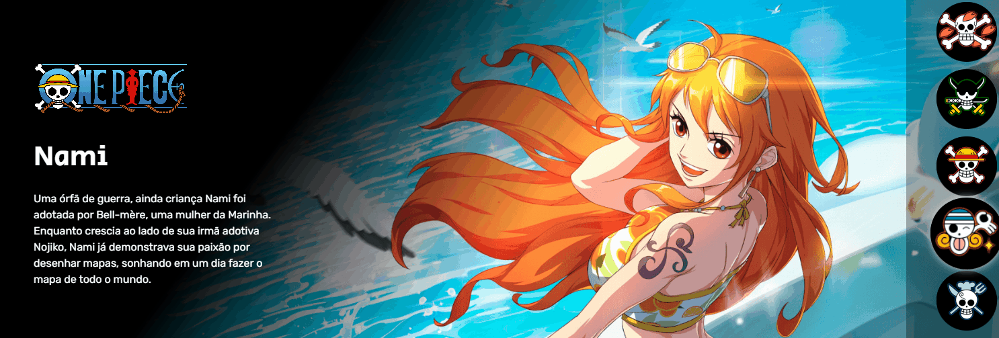

# ProjetoOnePiece
Meu projeto de início para minha caminhada na vida de desenvolvedor👾


## Tecnologias utilizadas
- HTML
- CSS
- JS

## Como utilizar
1 - Clone o projeto

```
git clone <https://github.com/Eduardo1346/ProjetoOnePiece.git>
```

2 - Acesse a pasta do projeto

```
cd repositorio-com-readme
```

## Dificuldades que eu tive
Nenhuma, o pai deselvonveu e seguiu com maestria todos os passos para realizar esse projeto